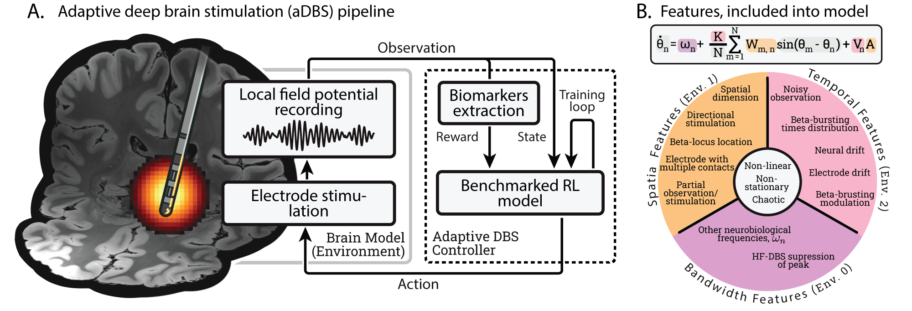

# Neurophysiologically Realistic Environment for Adaptive Deep Brain Stimulation (aDBS)
Code accompanying the research paper "Neurophysiologically Realistic Environment for Comparing Adaptive Deep Brain Stimulation Algorithms in Parkinson’s Disease" by Kuzmina E., Kriukov D., Lebedev M., Dylov. D, 2025, published in [???]()


## Description

This repository provides a neurophysiologically realistic environment for developing and benchmarking Reinforcement Learning (RL) algorithms for adaptive Deep Brain Stimulation (aDBS) in Parkinson’s Disease (PD). The framework is built around a computationally efficient Kuramoto model, simulating neural dynamics with three key feature groups:

1. Bandwidth Features: Beta-band oscillations (12–35 Hz) and other frequency bands to model PD biomarkers.
2. Spatial Features: Neuron-electrode interactions, partial observability, and directional stimulation.
3. Temporal Features: Neural/electrode drift, beta bursting, and non-stationary dynamics.

<p align="center">


</p>
<p align="center">
<em>Pipeline for adaptive Deep Brain Stimulation. And features, introduced in our environment to create realistic neural activity. </em>
</p>

The environment is designed for both neuroscientists (to bridge modeling with ML) and ML engineers (to tackle neurobiological challenges).

### Key Features

1. **Flexible Configuration**: Supports three pre-defined environment regimes (`env0`, `env1`, `env2`) with increasing complexity.
2. **Realistic PD Dynamics**: Simulates pathological oscillations, spatial coupling, and temporal drift.
3. **RL Integration**: Wrapped as a gymnasium environment (SpatialKuramoto) for seamless RL training.
4. **Benchmarking**: Includes baseline controllers (HF-DBS, PID) and tested RL algorithms.


## Usage

1. Clone the repository:
```bash
git clone https://github.com/NevVerVer/DBS-Gym  

```

2. Navigate to the repository directory:
```bash
cd DBS-Gym
```

3. Install the required packages:
```bash
pip install -r requirements.txt
```

### Basic Example
```bash
from neurokuranto.model_v1 import SpatialKuramoto  
from stable_baselines3 import PPO  

# Initialize environment  
env = SpatialKuramoto(params_dict=params_dict_train)  

# Train RL agent  
agent = PPO("MlpPolicy", env, n_steps=2048)  
agent.learn(total_timesteps=2e6)  
```

<p align="center">


</p>
<p align="center">
<em>Example of how usual high-frequency DBS works in the environment. </em>
</p>


### Environment Configurations
- `env0`: Bandwidth features only (beta oscillations).
- `env1`: Adds spatial features (electrode placement, partial observability).
- `env2`: Includes temporal drift and non-stationary dynamics.

Configuration files are in `environment/env_configs/`. Modify `params_dict` to adjust features.

### Reinforcement Learning Agents
Tested algorithms:
- Online RL: [`PPO`](https://stable-baselines3.readthedocs.io/en/master/modules/ppo.html#ppo), [`SAC`](https://stable-baselines3.readthedocs.io/en/master/modules/sac.html#module-stable_baselines3.sac), [`DDPG`](https://stable-baselines3.readthedocs.io/en/master/modules/ddpg.html#module-stable_baselines3.ddpg).
- Offline RL: [`IQL`](https://github.com/michelllepan/neural-coprocessors), [`CQL`](https://github.com/michelllepan/neural-coprocessors).

Agents were trained separately for each environment level and evaluated under perturbations (e.g., electrode drift).

### Stability Perturbation Test

To evaluate robustness, agents were tested under progressive disturbances. This an example of benchmarking task:

- *Electrode Encapsulation*: Conductance reduced by 25% every 5 episodes.
- *Neural Drift*: Natural frequencies shifted by 1% per episode.
- *Electrode Movement*: Random spatial shifts every 7 episodes.

Example results (see paper): `SAC` outperformed others in maintaining suppression under harsh drift.

## Further Research
- Implement custom reward functions (e.g., threshold-based efficiency).
- Extend with additional features (e.g., multi-contact electrodes, charge-balanced pulses).
- Benchmark novel RL algorithms or hybrid controllers.

The Kuramoto model is lightweight and modular — **ideal for rapid experimentation**!

## Citation
If you use the code or the findings from our paper, **please cite**:

<!-- *Kuzmina, E., Kriukov, D., & Lebedev, M.* (2024). Neuronal travelling waves explain rotational dynamics in experimental datasets and modelling. Scientific Reports, 14(1), 3566.(**doi**: https://doi.org/10.1038/s41598-024-53907-2)

```bash
@article{kuzmina2024neuronal,
  title={Neuronal travelling waves explain rotational dynamics in experimental datasets and modelling},
  author={Kuzmina, Ekaterina and Kriukov, Dmitrii and Lebedev, Mikhail},
  journal={Scientific Reports},
  volume={14},
  number={1},
  pages={3566},
  year={2024},
  publisher={Nature Publishing Group UK London}
}
``` -->


## Contact
For any questions or clarifications, please reach out to: *ekaterina.kuzmina@skoltech.ru*


## Acknowledgments

<!-- Special thanks to @nosmokingsurfer for their valuable feedback and suggestions. -->
Thanks to @michelllepan and @vivekmyers for the [CQL implementation](https://github.com/michelllepan/neural-coprocessors).

## Contributing
We welcome contributions to this repository! If you're found errors in code or experiments, please open an issue to discuss your ideas.


## License
This project is licensed under the MIT License - see the LICENSE file for details.
